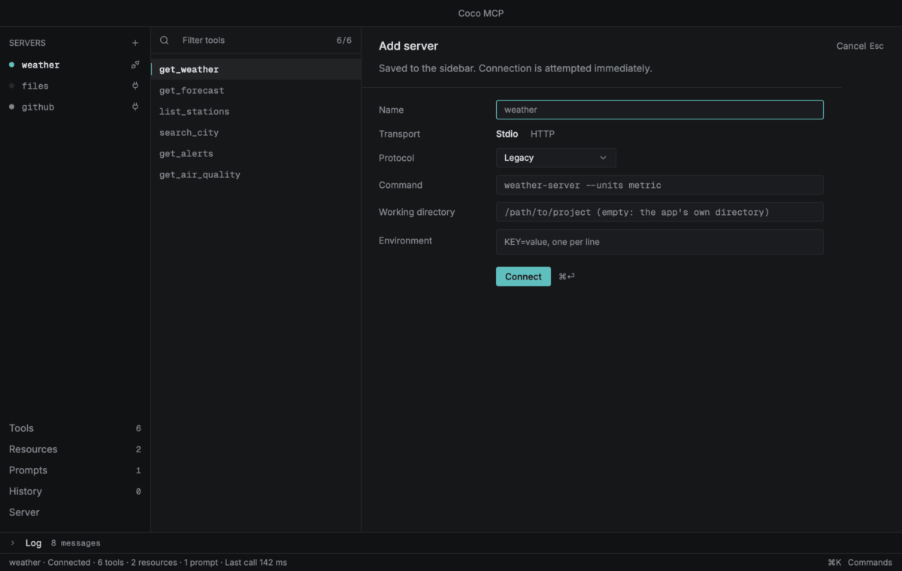
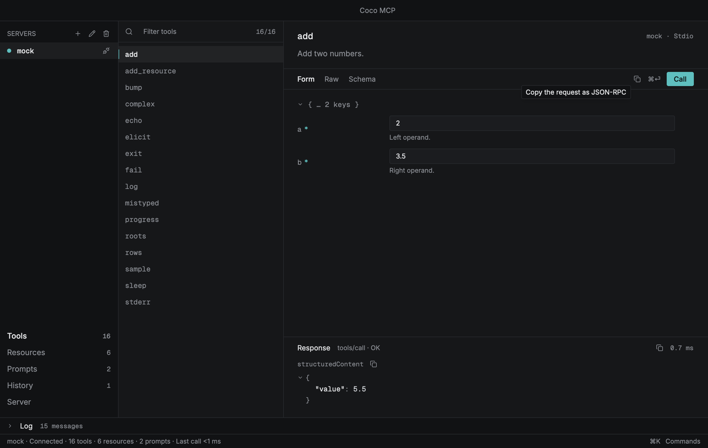
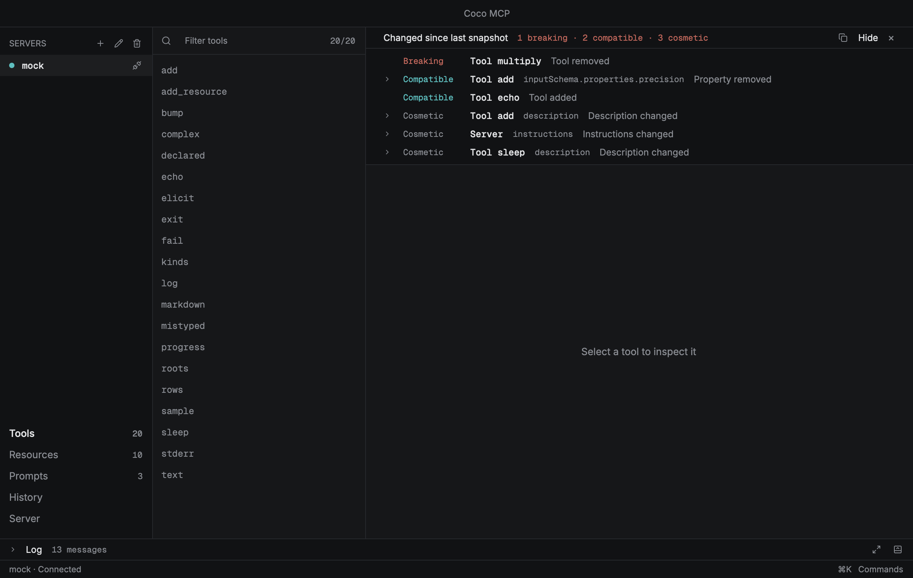
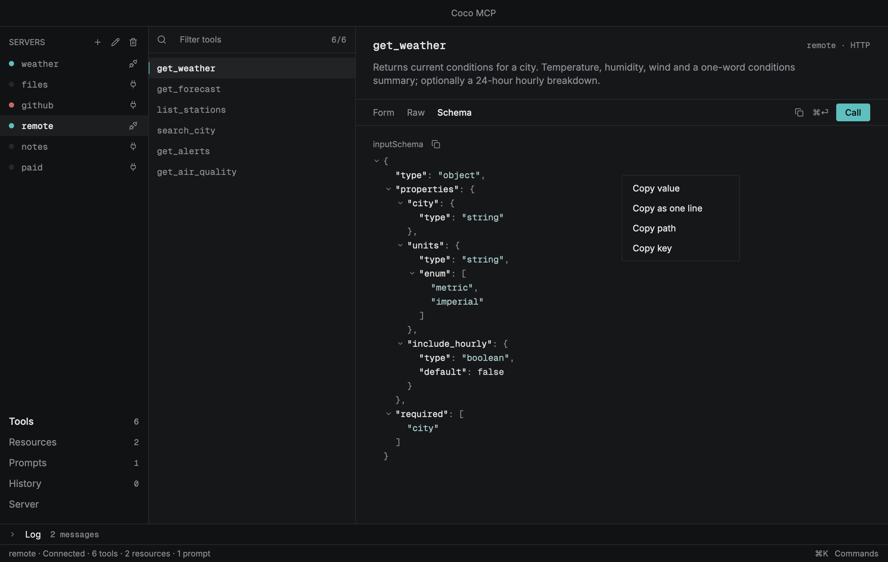

<p align="center">
  <picture>
    <source media="(prefers-color-scheme: dark)" srcset="docs/logo-dark.svg">
    
  </picture>
</p>
<h1 align="center">Coco MCP</h1>
<p align="center">Inspect and debug MCP servers in depth, from the command line or a native window.</p>

Coco MCP is a tool for inspecting and debugging
[Model Context Protocol](https://modelcontextprotocol.io) servers: connect
to one, see what it offers, call it with any payload, read every message on
the wire, and keep what you learned. It is one binary, written in Rust and
drawn by [GPUI](https://www.gpui.rs): `coco-mcp --cli` runs a command,
`coco-mcp --desktop` opens a native window, and both work from the same
core.



## Why

I wrote Coco because the way I was inspecting MCP servers kept getting in
my way. I needed to send a raw JSON payload, not only what a form would let
me type. I needed several servers connected at the same time, each with its
own log. I needed the tool to stay fast with a long log and a large result
on screen, and I needed it to remember the servers and the calls from
yesterday. So Coco does those things first:

- **Any payload.** The Raw tab next to the generated form takes whatever
  JSON you paste, checks it against the tool's schema before it is sent,
  and copies the request as JSON-RPC or `curl` exactly as it goes out.
- **Many servers at once.** Every server in the sidebar has its own
  session, wire log and history, all connected together; switching is a
  click or `⌘K`.
- **Fast, and still fast an hour later.** A native binary drawn on the GPU,
  with lists that build only the rows in view and a drawing budget for big
  results, so a long session costs no more per frame than a short one.
- **Memory.** Servers, calls and snapshots persist, a call can be replayed
  or opened back in the form, and each connect is diffed against the last
  snapshot so a breaking change in a server is noticed, not discovered.

The command line exists so the same things can be scripted, and so a
breaking change can fail a CI job.

## Built in Rust, drawn by GPUI

Coco is a native program from the wire to the pixels, and that shows in
use:

- **It starts in a blink and stays light.** The window is a single native
  binary: nothing to boot before the first frame, no runtime to install, no
  browser process beside it. Memory stays flat through a long session,
  since every table, log and tree is drawn from the model, not kept as
  markup.
- **The UI is drawn on the GPU.** The window is built with GPUI, the
  engine the [Zed](https://zed.dev) editor is written in: a retained scene
  rendered through Metal, Vulkan or DirectX. A log drawer with thousands of
  messages, a schema tree with hundreds of nodes and a result of many
  megabytes scroll at the frame rate, and every list builds only the rows in
  view.
- **One core, two faces.** The protocol client, the storage, the schema
  forms, the diff and the export formats are plain Rust crates with no UI in
  them. The command line and the window are two thin layers over the same
  code, so what one shows, the other can script, and neither can drift
  from the other.
- **The whole UI runs headless.** Because GPUI can render without a
  display, every screen in this README is produced by a test that drives
  the real window against a mock server, and the animated tour above is
  assembled from those frames. What you see is what the tests saw.
- **Rust end to end.** No unsafe code, no `unwrap` outside tests, every
  dependency under a permissive licence, audited in CI. Secrets
  go to the OS keyring through native bindings; the database is SQLite,
  compiled in.

## What it does

- **Connect** to stdio servers (any command) and streamable HTTP servers, with
  custom headers, bearer tokens or OAuth 2.1 (PKCE, dynamic registration).
  Secrets live in the OS keyring, never in the database.
- **Speak either era** of the protocol: the `initialize` handshake (2024-11-05
  to 2025-11-25) or the sessionless 2026-07-28 revision, chosen per server.
  Every feature follows the version the server agreed to and what it
  declared; one it cannot use stays on screen, disabled, and says why.
- **Browse** tools, resources, resource templates and prompts with an inline
  filter and keyboard navigation.
- **Call** tools through a form generated from the tool's JSON Schema
  (nested objects, arrays, enums, `oneOf`), or edit the raw JSON. Arguments
  are validated against the schema before they are sent.
- **See** responses as collapsible JSON, text, Markdown or images, with
  round-trip times, and every wire message in a filterable log drawer (`⌘J`),
  where a row unfolds into the same tree as a response and, opened or
  closed, moves to the top of the drawer. A reconnect keeps
  the previous connection's messages above a separator, so the reason a
  server stopped is still there.
- **Answer** server-initiated requests: elicitation forms, sampling and
  roots are shown as dialogs instead of being auto-rejected.
- **Remember** every call. The History view replays a call or loads its
  arguments back into the form; its filter matches a call's name, arguments,
  result and error, so one word finds a call in a long history. The bin
  above the list empties it after a confirmation; the bin on a call deletes
  that call alone.
- **Notice changes.** Each connect is compared with the last stored snapshot
  and a banner classifies every difference as breaking, compatible or
  cosmetic, direction-aware for input and output schemas.
- **Take it away.** Right-click any node of any tree to copy its value, its
  path or its key; copy a whole response, a tool's schema, a request as
  JSON-RPC or as `curl`; export the snapshot, the wire log, the call history
  and the client config to files. Bearer tokens are redacted everywhere
  except the one action named for them.
- **Bring it in.** Import an `mcpServers` file from another MCP client and
  every server it names is added at once, with any token it carried moved
  into the keyring.
- **Script it** with `coco-mcp --cli`: snapshot, call, read, prompt, diff
  (exit 1 on a breaking change) and export the saved servers as an
  `mcpServers` block.

| | |
|---|---|
|  |  |

## Install

Every release ships the binary for macOS (arm64 and x86_64), Linux
(x86_64) and Windows (x86_64), built by the release workflow from the
tagged source. Three ways to get it:

**From the release page.** Download the archive for your platform from
[the latest release](https://github.com/camiloazula/coco-mcp/releases/latest),
check it against `SHA256SUMS`, and put `coco-mcp` somewhere on your `PATH`.
A file saved by a browser is quarantined on macOS and refused until you
allow it under Privacy & Security in System Settings, or clear the mark:

```bash
xattr -d com.apple.quarantine coco-mcp
```

Fetching the archive with `curl` sets no such mark. Windows asks once in
the same way; "More info", then "Run anyway".

**With Homebrew**, on macOS or Linux:

```bash
brew install camiloazula/coco/coco-mcp
```

The formula builds the tagged source of the latest release with Cargo,
installing a Rust toolchain for the build if you have none; `brew upgrade
coco-mcp` follows new releases. Its tap lives at
[camiloazula/homebrew-coco](https://github.com/camiloazula/homebrew-coco).

**With Cargo** (Rust 1.90 or newer), from source:

```bash
cargo install --locked --git https://github.com/camiloazula/coco-mcp coco-mcp
```

`--locked` builds with the exact dependency versions in the committed
`Cargo.lock`, the set the tests and the licence audit ran against. To
update a Cargo install, run the install command again; `cargo install
--list` shows what is installed and from which commit, and `cargo uninstall
coco-mcp` removes it. Building needs a C toolchain and the system libraries
GPUI and the keyring link against; the CI workflow in
`.github/workflows/ci.yml` lists the packages it installs.

However it arrived, it is one binary, `coco-mcp`, with two modes:

```bash
coco-mcp                   # the window (`--desktop` says the same)
```

```bash
coco-mcp --cli --help      # the command line; every command follows --cli
```

From a checkout, `just run` opens the window and `just coco --help` the
command line.

## The desktop mode

`coco-mcp` alone, or with `--desktop`, opens the window. Press `⌘N` (or the
`+` in the sidebar) to add a server. A stdio server is a
command line, such as `filesystem-server --root /tmp`,
an optional working directory and optional `KEY=value` environment lines.
The line is split the way a shell splits
it, so an argument with a space in it is quoted (`"my notes"`), but it never
runs through a shell: nothing is expanded. An HTTP server is a URL plus
optional headers and an auth mode. The pencil next to it (`⌘E`), or Settings
at the end of the Server view's list, opens the same form prefilled with the
selected server's settings; Connect saves them and reconnects. A server that
is not connected shows that form as its pane, so it can be connected as it is
or changed first. The bin deletes the selected server after a confirmation.
Each icon shows its action on hover. The plug at the end of a server's row
connects it, or disconnects it when it is connected; a double-click on the
row does the same.

### Protocol eras

The server form's Protocol row chooses how the server is reached:

- **Legacy** (the default) starts with the `initialize` handshake, offers
  2025-11-25 and accepts any older version the server answers with.
- **Auto** asks with `server/discover` for 2026-07-28 and falls back to the
  handshake when the server does not speak it.
- **Modern** uses 2026-07-28 only, and says so when the server cannot.

The Server view names the agreed version and its era (`Protocol 2026-07-28 ·
Modern`). On a modern server the app works the same from the outside, by
the revision's own means: sampling, elicitation and roots requests come
inside a call and open the same dialogs; list changes and resource updates
arrive on a `subscriptions/listen` stream the app keeps open; the log level
travels with each request, and the server logs only while one runs; saved
roots reach the server when it asks, with no change notice; and nothing
pings the server, since the revision has no `ping`. Log level, sampling and
roots carry a quiet "Deprecated in 2026-07-28" where they are used.

The Server view also holds the roots offered to the server, which can be
edited there, the snapshots stored for it, any two of which can be compared
in the change banner's terms, and the settings a connected server accepts
(log level, subscriptions).

A feature that the agreed version or the server does not support is never
hidden: its control is dimmed, its reason shows on hover ("The server doesn't
offer resource subscriptions", "Connect to use this") and appears in the
status bar when it is pressed.

Keyboard:

| Key | Action |
|---|---|
| `⌘K` | Command palette (switch server, views, connect, edit, theme, log) |
| `⌘N` | Add server |
| `⌘E` | Edit the selected server |
| `⌘⏎` | Call the tool, read the resource, get the prompt, or replay; in the server form, connect |
| `⌘.` | Cancel the running request; the server is told |
| `⌘1` … `⌘5` | Tools, Resources, Prompts, History, Server |
| `⌘J` | Toggle the log drawer |
| `⌘R` / `⌘⇧R` | Connect or reconnect / disconnect (the plug on the server's row does the same) |
| `⌘⌫` | Delete the selected server (asks first; the bin next to `+` does the same) |
| `⌘⇧C` | Copy the whole response |
| `⌘T` | Dark or light theme (remembered) |
| `⌘Q` | Quit |
| `↑` `↓` | Move in the focused list; `⏎` moves into the detail, or connects the selected server in the sidebar |
| `⏎` / `Esc` | In a dialog: answer or confirm / cancel |
| `Esc` | Close the copy menu, a confirmation, a pending server request, the palette, the server form or the drawer, whichever is open |

The application menu has "About Coco MCP", which opens a small
window with the version, the commit and date it was built from, the licence,
and links to the source repository and the issue tracker. The File, Edit,
Server and View menus carry the actions of the shortcuts and the palette
(the call itself stays on `⌘⏎` and in the palette); an item that cannot run
for the selected server is disabled. The Server menu also clears a server's
call history and forgets its stored credentials, each after a confirmation,
and the palette alone clears the log.

### Getting servers in

File > Import Servers… reads an `mcpServers` file, the block MCP clients
keep their server lists in, and adds every server it names. The protocol
specifies the wire format, not the config file, so this is a convention
rather than a standard: the reader takes the entries under `mcpServers`,
under `servers`, or a bare object, which covers what clients write in
practice. Nothing is connected: an imported file can name a dozen servers, and
spawning a dozen processes is not what an import should do. Press `⌘R` or
the Connect button on the one you want.

A name already in the sidebar is skipped rather than overwritten, and an
entry that describes neither a command nor a URL is reported instead of
silently dropped. A server the database could not write is counted as not
saved, and the status bar says why. An `Authorization: Bearer` header is
moved out of the headers into the keyring, since `ServerSpec` keeps only
non-secret headers; a placeholder such as the `<token>` this app exports
leaves the server without one, which the import summary counts and the
edit form fills in. An entry configured for SSE is added as streamable
HTTP, with a note, since that is the only HTTP transport the app speaks.

`coco-mcp --cli import-config <file>` does the same without the window.

### Getting data out

A debugger is only useful if what it shows can leave it, so everything on
screen has a way out.



- **Right-click any line of any JSON tree** for its value, the same value on
  one line, its path (`$.content[0].text`) and its key. A string copies as
  its text, not as a quoted JSON literal.
- **Right-click a log row** for its payload, for the whole JSON-RPC frame
  with its id, for the line as the drawer shows it, and, when the app sent
  it in full to an HTTP server, for the `curl` that would send it again.
  None of it needs the row expanded. A server in the sidebar copies its
  client config the same way, and a text or resource block in a response
  copies its text or its URI.
- **The copy icon** next to a section copies that whole value: the response,
  `structuredContent`, a tool's input or output schema, a history call's
  arguments, a server request, a diff's before and after. The one in the
  toolbar copies the request as it stands, before it is sent.
- **The File menu** writes four files through the save panel: the snapshot
  (`.json`, the same artefact `diff` compares, so it works as a
  committed baseline), the wire log and the call history (`.jsonl`, one
  message or call per line), and the `mcpServers` config.
- **A binary resource** has a save button under it, which is the only way to
  get the bytes of a PDF or an image out of a `resources/read`.
- **The diff banner** copies its change list as a Markdown table.

`curl` output carries the two headers streamable HTTP requires and posts a
single JSON-RPC message; a server that keeps sessions will want an
`initialize` handshake first. A bearer token is written as `$MCP_TOKEN` and
the client config as `Bearer <token>`: the real value only ever reaches the
clipboard through "Copy Bearer Token" in the Server menu.

Data lives in `coco.db` under the platform's data directory for
`coco-mcp`.

### What to know before pointing it at a server

Coco MCP runs what you give it and shows what comes back, so a few things
are worth knowing:

- A stdio server is a process started as you, with your environment plus
  the lines you add, and it can do anything you can. Disconnecting kills
  that process and closes its input; a program it started in turn, and that
  ignores the closed input, can outlive it.
- Bearer tokens and OAuth credentials go to the OS keyring. Everything else
  in a server's settings is stored in `coco.db` as typed: headers other
  than `Authorization`, and environment variables unless their name ends in
  `_TOKEN`, `_SECRET` or `_API_KEY`, which the app refuses to store. So are
  every call's arguments and results. The file is created readable by you
  alone where the filesystem has permission bits.
- A plain `http://` server gets its bearer token in clear text. The CLI
  warns; the app does not stop you.
- A server can ask you to open a URL (a URL elicitation) and, through an
  OAuth flow, name the page you sign in on. Only `http` and `https` URLs are
  opened, the dialog shows the URL first, and nothing is opened without your
  answer. Links inside a Markdown response open in the browser when clicked.
- A server can only claim what it returns; nothing it sends is executed
  here. Responses larger than the drawing budget are held back until asked
  for, lists are read for at most a thousand pages, and a child's stderr is
  kept a line at a time.

## The command-line mode

Everything after `--cli` is the command line, as it is:

```bash
coco-mcp --cli snapshot stdio -- some-server --verbose    # print tools/resources/prompts
coco-mcp --cli snapshot --protocol auto https://example.com/mcp
coco-mcp --cli snapshot https://example.com/mcp --oauth --out a.json
coco-mcp --cli call stdio:some-server add --args '{"a": 2, "b": 3}'
coco-mcp --cli read stdio:some-server file:///etc/hosts
coco-mcp --cli prompt stdio:some-server greet --args '{"name": "Ada"}'
coco-mcp --cli --db coco.db history --server "some-server" --limit 20
coco-mcp --cli diff a.json b.json --text                   # exit 1 when breaking
coco-mcp --cli --db coco.db diff saved:weather~1 saved:weather
coco-mcp --cli --db coco.db export-config                  # mcpServers block
coco-mcp --cli --db coco.db import-config ./mcp-servers.json
```

A live source is `stdio:<command>`, `stdio -- <command> [args]` or an
`http(s)://` URL (`-H 'Name: value'` or `-H Name=value`, `--bearer-env VAR`,
`--oauth`; the HTTP flags are ignored for a stdio source). `snapshot` and
`diff` also take a snapshot file, or `saved:<name>[~N]` for a snapshot
recorded with `--db`, where `~N` counts back from the newest (`saved:weather`
is the latest, `saved:weather~1` the one before). `diff` takes no `stdio --`
form, since its two sides are positional; quote the command into a `stdio:`
source instead. `call`, `read` and `prompt` need a live server. A snapshot
missing a list that failed is printed but not recorded.

Exit codes: 0 ok, 1 breaking change, 2 operational failure, which for `diff`
includes a list one side could not read and so was not compared; a breaking
change among the lists that were compared still exits 1. A tool that answers
with `isError` prints its result and exits 2.

`stdio:<command>` is split the way a shell splits a command line: quotes
group and a backslash escapes, an unquoted `#` starts a comment, and nothing
is expanded, so a path with a space in it goes in quotes
(`stdio:'/opt/my tools/server'`). The words after `stdio --` are passed as
they are. `--db` saves a live server under the command line its `Connecting`
line prints, with each word that needs it quoted (`srv '--port=3000'`), and
that line is a `stdio:` source for the same server. `saved:`, `history
--server` and `export-config --server` find it by that name or by any other
spelling of the same command line (`srv --port=3000`); two saved servers
with the same command line are reported, not guessed between.

`--protocol legacy|auto|modern` picks the era for a live source, as the
app's Protocol row does; without it a server saved with `--db` connects in
the mode it was saved with, and any other in `legacy`. A new server saved by
`--db` keeps the mode it was first connected in.

The window asks you about sampling, elicitation and roots through a dialog,
and a server saved from the command line gets that same policy; the command
line itself has nobody to ask, so it refuses sampling, declines elicitation
and advertises no roots, whether the server asks with a request of its own
or inside a call.

Results go to stdout as JSON (`--compact` for one line); a snapshot carries a
`digest`, and a call, read or prompt result an `_elapsedMs`. `snapshot --out`
writes the file instead, `diff --text` prints a plain listing, and `--cli`
alone prints the help. Progress, warnings and errors go to stderr as
cargo-style status lines, so `coco-mcp --cli snapshot … | jq` stays clean; `--events`
adds every wire message and state change to them. Colour follows the
terminal and honours `NO_COLOR`; `--color always|never|auto` overrides it.
`--timeout SECS` (default 60) bounds each request, and `--db` also records
every call, read and prompt, which is what `history` lists.

## Development

```bash
just              # list every recipe
just check        # fmt, clippy -D warnings, tests and cargo-deny, the binary included
just test-app     # the binary's unit tests, command-line tests and headless flows (builds the mock server)
just clippy-app   # clippy for the binary and its GPUI views
just mock         # run the hermetic mock MCP server, e.g. `just mock --schema v2`
just screenshots  # headless UI flows against the mock server (macOS); also writes tour.gif
```

The workspace is split into UI-free crates (`mcp-core`, `mcp-schema-form`,
`mcp-store`, `mcp-auth`, `mcp-diff`, `mcp-exchange`, `mcp-mockserver`), the
command-line library (`apps/cli`, package `coco-cli`) and the one binary with
the desktop views (`apps/desktop`, package `coco-mcp`). `CONTRIBUTING.md` lists the constraints,
the pinned stack and the engineering notes. The headless screenshot test
drives the real UI against the bundled mock server, writes
`target/screenshots/`, assembles the README's `tour.gif` from a fixed list of
those renders, and fails if the mock server has not been built.

## Licence

Copyright (c) 2026 Camilo Azula. Licensed under either of

- Apache License, Version 2.0 ([LICENSE-APACHE](LICENSE-APACHE)), or
- MIT license ([LICENSE-MIT](LICENSE-MIT))

at your option. Unless you explicitly state otherwise, any contribution
intentionally submitted for inclusion in the work by you, as defined in the
Apache-2.0 license, shall be dual licensed as above, without any additional
terms or conditions.

The whole stack is open source. Every dependency is under a permissive
licence on the allow-list in `deny.toml`: MIT, Apache-2.0, BSD-2-Clause,
BSD-3-Clause, MPL-2.0, ISC, Zlib, and a few public-domain-style
dedications (Unicode-3.0, 0BSD, MIT-0, CC0-1.0, bzip2-1.0.6). No GPL, LGPL,
AGPL or source-available licence is in the build; `cargo deny check licenses`
enforces this locally and in CI, and a crate offered under a choice of
licences is taken under the permissive one. The bundled fonts,
[Inter](https://rsms.me/inter/) and [Geist Mono](https://vercel.com/font),
are under the SIL Open Font License 1.1 (their licence texts sit next to
them in `apps/desktop/assets/fonts/`); no proprietary system font is used.
The icon and the `coco` mark in `apps/desktop/assets/` are part of this
project and carry the same licence as the code. The UI engine is the
published `gpui-pre` crate (Apache-2.0); no code is copied from the Zed
repository.

## Notice

This software is provided "as is", without warranty of any kind, express or
implied, including but not limited to the warranties of merchantability,
fitness for a particular purpose and non-infringement. The author accepts no
responsibility or liability for how it is used or for any effect, loss or
damage arising from its use, in whole or in part. It launches the commands
you give it, connects to the servers you point it at, stores what they
return and sends the credentials you configure; you are responsible for what
you connect it to and for what it does on your behalf. Use it at your own
risk. See the licence texts above for the full terms.
